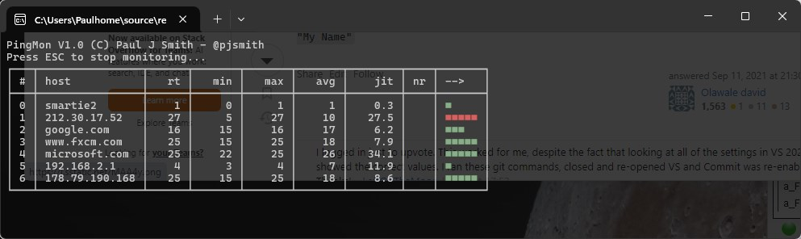

PingMon

A simple console ping monitoring tool written in .NET 8.

Monitors a list of host names over ICMP until stopped, diplaying the responses, min, max, avg, and jitter for the last 100 samples.

Also shows the number of lost responses and a graphical bar indicating response times. This is coloured based on the average response time for that host so far.

Add your default hosts to monitor in the code, or supply a list of hostnames on startup.

